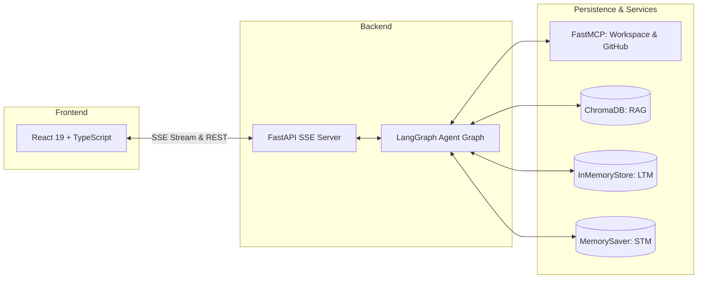

# Agentic AI RAG Chatbot — Project Master Documentation

Welcome to the **Agentic AI RAG Chatbot** project documentation. This document serves as the master entrypoint and overview of the entire system architecture, technical implementations, integrations, and operational guides.

---

## 1. System Overview

The Agentic AI RAG Chatbot is an enterprise-grade, event-driven assistant built with **LangGraph**, **FastAPI**, **React 19 + TypeScript**, and the **Model Context Protocol (MCP)**. It integrates conversational intelligence, dynamic tool execution, long-term memory personalization, semantic RAG retrieval, and server-enforced Human-in-the-Loop (HITL) safety controls.



---

## 2. Documentation Directory Index

Detailed technical specifications and subsystem guides are located in the [`docs/`](file:///c:/Users/PC-ACER/Documents/DeepLearning/ChatGpt/docs/) directory:

| Document | Description |
|---|---|
| 📐 [**Architecture Guide**](file:///c:/Users/PC-ACER/Documents/DeepLearning/ChatGpt/docs/ARCHITECTURE.md) | High-level system design, LangGraph graph topology, node execution flows, and state schemas. |
| 🛡️ [**HITL Safety Guidelines**](file:///c:/Users/PC-ACER/Documents/DeepLearning/ChatGpt/docs/HITL_GUIDELINES.md) | Human-in-the-loop safety principles, risk-tiered tool matrix, interrupt/resume lifecycle, and UI contracts. |
| 🧠 [**Memory Architecture**](file:///c:/Users/PC-ACER/Documents/DeepLearning/ChatGpt/docs/MEMORY.md) | Short-Term Memory checkpointer, Long-Term Memory extraction, atomic categories, and conflict resolution. |
| 📚 [**RAG Knowledge Base**](file:///c:/Users/PC-ACER/Documents/DeepLearning/ChatGpt/docs/RAG.md) | PDF/TXT/MD ingestion, RecursiveCharacterTextSplitter chunking, ChromaDB vector store, and citations. |
| 🔌 [**MCP Protocol & Servers**](file:///c:/Users/PC-ACER/Documents/DeepLearning/ChatGpt/docs/MCP.md) | FastMCP architecture, stdio transport, Google Workspace OAuth2, and GitHub REST API integration. |
| 🛠️ [**Tool Registry & Inventory**](file:///c:/Users/PC-ACER/Documents/DeepLearning/ChatGpt/docs/TOOLS.md) | Complete list of built-in, MCP, and RAG tools, side-effect classifications, and runtime permissions. |
| ⚡ [**Streaming Protocol (SSE)**](file:///c:/Users/PC-ACER/Documents/DeepLearning/ChatGpt/docs/STREAMING.md) | Server-Sent Events specification, event taxonomy (`token`, `tool_call_*`, `hitl_interrupt`), and wire payloads. |
| 🔍 [**Observability & LangSmith**](file:///c:/Users/PC-ACER/Documents/DeepLearning/ChatGpt/docs/LANGSMITH.md) | Distributed tracing, run trees, metadata tags, structured logging, and dynamic tracing toggles. |
| 💾 [**Database & Persistence**](file:///c:/Users/PC-ACER/Documents/DeepLearning/ChatGpt/docs/DATABASE.md) | Checkpoint storage (`MemorySaver`), memory store namespaces, and ChromaDB vector collections. |
| 🌐 [**REST & SSE API Reference**](file:///c:/Users/PC-ACER/Documents/DeepLearning/ChatGpt/docs/API.md) | Comprehensive FastAPI endpoints, request/response models, and error definitions. |
| 💻 [**Frontend Architecture**](file:///c:/Users/PC-ACER/Documents/DeepLearning/ChatGpt/docs/FRONTEND.md) | React 19 + TypeScript components, `useChat` custom hook, approval cards, and modals. |
| 🚀 [**Development & Setup**](file:///c:/Users/PC-ACER/Documents/DeepLearning/ChatGpt/docs/DEVELOPMENT.md) | Quickstart guide, environment configuration, virtual environments, and running `pytest`. |
| 🔧 [**Troubleshooting & Bug Fixes**](file:///c:/Users/PC-ACER/Documents/DeepLearning/ChatGpt/docs/TROUBLESHOOTING.md) | Log of historical issues, root-cause analyses, and validated bug fixes. |
| 📋 [**Architecture Decisions (ADRs)**](file:///c:/Users/PC-ACER/Documents/DeepLearning/ChatGpt/docs/DECISIONS.md) | Architectural Decision Records ADR-001 through ADR-005. |
| 📝 [**Changelog**](file:///c:/Users/PC-ACER/Documents/DeepLearning/ChatGpt/CHANGELOG.md) | Chronological log of versions, additions, and updates. |

---

## 3. Technology Stack & Installed Versions

| Component | Technology | Installed Version |
|---|---|---|
| **Agent Orchestration** | LangGraph | `1.2.11` |
| **Agent Core & Runnables** | LangChain Core / Community | `1.5.5` / `1.3.15` |
| **LLM Provider Bridge** | LangChain OpenAI / Groq | `1.5.1` / `1.1.3` |
| **Backend Web Framework** | FastAPI / Uvicorn | `0.141.1` / `0.52.3` |
| **MCP Integration** | FastMCP / `langchain-mcp-adapters` | `1.29.0` / `0.3.2` |
| **Vector Database** | ChromaDB | `1.5.9` |
| **Google Cloud APIs** | `google-api-python-client` | `2.198.0` |
| **Frontend Framework** | React 19 | `19.2.8` |
| **Frontend Build Tool** | Vite | `8.2.0` |
| **Styling** | TailwindCSS v4 | `4.3.3` |
| **Testing** | Pytest / Pytest-Asyncio | `9.1.1` / `0.24.0` |

---

## 4. Quick Verification Commands

```bash
# 1. Run all backend tests
cd backend
.venv\Scripts\pytest -v

# 2. Test live MCP GitHub query
.venv\Scripts\python -c "from app.mcp.servers.github_server import github_get_my_repos; print(github_get_my_repos(limit=3))"

# 3. Test live Google Calendar query
.venv\Scripts\python -c "from app.mcp.servers.google_workspace import gcalendar_list_events; print(gcalendar_list_events(date='2026-08-18'))"
```
