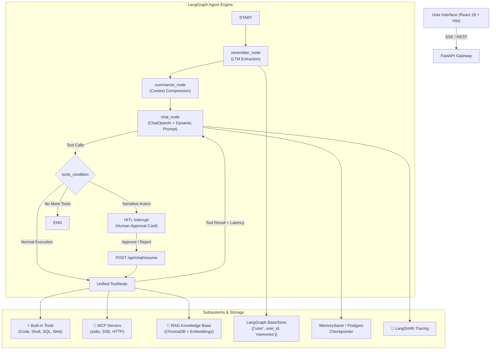

# Agentic AI RAG Chatbot

An enterprise-grade, full-stack **Agentic AI Assistant** built with **LangGraph**, **FastAPI**, **React 19**, **TypeScript**, and **Tailwind CSS v4**.

Features native **ReAct agent workflows**, **real-time Server-Sent Events (SSE) streaming**, **RAG knowledge retrieval**, **Built-in Developer Tools**, **Model Context Protocol (MCP) server integration**, **LangSmith Observability**, **Long-Term Memory (LTM)**, **Rolling Conversation Summarization**, and **Human-in-the-Loop (HITL)** approval workflows.

---

## System Architecture



---

## Key Features

| # | Feature | Subsystem | Description |
|---|---|---|---|
| 1 | **Foundation + LangGraph Core** | `backend/app/agent/` | Graph-based state machine with `StateGraph`, `AgentState`, and `ChatOpenAI`. |
| 2 | **Real-Time Streaming** | `backend/app/streaming/` | Line-buffered SSE (`/api/chat/stream`) mapping `astream_events` v2 with abort support. |
| 3 | **Multi-Thread Persistence** | `backend/app/persistence/` | Multi-thread checkpointing with auto-titling and `ThreadSidebar.tsx`. |
| 4 | **RAG Knowledge Base** | `backend/app/rag/` | PDF/MD/TXT loaders, recursive chunking, ChromaDB vector store, and citations. |
| 5 | **Developer Tools** | `backend/app/tools/builtin/` | Sandbox Python evaluator, safe shell runner, filesystem inspector, SQL reader, docs search. |
| 6 | **MCP Integration** | `backend/app/mcp/` | Multi-server MCP manager (`stdio`, `sse`, `streamable_http`) with runtime discovery. |
| 7 | **Unified Tool Engine** | `backend/app/tools/executor.py` | Badges (`⚡ Built-in`, `🔌 MCP`, `📄 RAG`) and high-precision execution latency timer. |
| 8 | **LangSmith Observability** | `backend/app/observability/` | Native tracing with hierarchical run names, tags, and run metadata. |
| 9 | **Long-Term Memory** | `backend/app/memory/` | Cross-thread `BaseStore` memory with automatic structured fact extraction. |
| 10 | **Memory Summarization** | `backend/app/agent/nodes/summarize.py` | Rolling conversation compression and `RemoveMessage` history pruning. |
| 11 | **Memory Cleanup** | `backend/app/memory/cleaner.py` | Contradiction reconciliation engine, retention limits (max 50), and manual editing. |
| 12 | **Human-in-the-Loop** | `backend/app/hitl/` | `interrupt()` before sensitive tools, interactive UI approval cards, and resume streaming. |

---

## Directory Structure

```
ChatGpt/
├── backend/
│   ├── app/
│   │   ├── agent/                 # LangGraph graph, nodes (chat, tools, remember, summarize)
│   │   ├── api/                   # REST endpoints (chat, threads, documents, tools, mcp, memory)
│   │   ├── core/                  # Configuration & structured logging
│   │   ├── hitl/                  # Human-in-the-Loop tools & policies
│   │   ├── llm/                   # ChatOpenAI factory
│   │   ├── mcp/                   # MCP client & configuration manager
│   │   ├── memory/                # Long-Term Memory BaseStore & conflict cleaner
│   │   ├── observability/         # LangSmith tracing setup & config builder
│   │   ├── persistence/           # Thread store & checkpointing
│   │   ├── rag/                   # Document loaders, chunking, ChromaDB vector store
│   │   ├── streaming/             # Server-Sent Events (SSE) adapter & event schemas
│   │   └── tools/                 # Centralized ToolRegistry & built-in developer tools
│   ├── tests/                     # 42+ unit, integration, and E2E test cases
│   └── requirements.txt
├── frontend/
│   ├── src/
│   │   ├── components/
│   │   │   ├── chat/              # ChatWindow, MessageList, MessageInput, Message
│   │   │   ├── hitl/              # HitlApprovalCard (Approve, Reject, Edit JSON)
│   │   │   ├── mcp/               # MCPServersModal
│   │   │   ├── memory/            # MemoryModal (View, Add, Edit, Optimize, Clear)
│   │   │   ├── rag/               # DocumentUploadModal, SourceCitation
│   │   │   ├── threads/           # ThreadSidebar
│   │   │   └── tools/             # ToolCall (Latency & badge), ToolListModal
│   │   ├── hooks/                 # useChat, useThreads
│   │   ├── services/              # api.ts (SSE streaming & REST client)
│   │   └── types/                 # TypeScript interfaces
│   └── package.json
└── README.md
```

---

## Getting Started

### Prerequisites
- **Python 3.11+**
- **Node.js 18+ & npm**
- **OpenAI API Key**

### 1. Backend Setup

```bash
cd backend

# Create and activate virtual environment
python -m venv .venv
.venv\Scripts\activate      # On Windows
source .venv/bin/activate    # On macOS/Linux

# Install dependencies
pip install -r requirements.txt

# Configure environment variables
# Copy .env.example or create .env:
OPENAI_API_KEY=sk-...
LANGCHAIN_TRACING_V2=false
LANGCHAIN_API_KEY=lsv2_pt_...
```

### 2. Frontend Setup

```bash
cd frontend

# Install dependencies
npm install

# Start development server
npm run dev
```

### 3. Running Backend Server

```bash
cd backend
.venv\Scripts\python -m uvicorn app.main:app --reload --port 8000
```

---

## Running Tests

### Backend Automated Test Suite (42+ Tests)

```bash
cd backend
.venv\Scripts\python -m pytest -v
```

### Frontend Build Verification

```bash
cd frontend
npm run build
```

---

## API Endpoints

| Endpoint | Method | Description |
|---|---|---|
| `/api/chat` | `POST` | Synchronous chat message execution |
| `/api/chat/stream` | `POST` | Real-time SSE token & tool execution stream |
| `/api/chat/resume` | `POST` | Resume interrupted graph with human decision |
| `/api/chat/resume/stream` | `POST` | Resume interrupted graph with SSE stream |
| `/api/threads` | `GET/POST` | List and create conversation threads |
| `/api/threads/{id}` | `GET/PATCH/DELETE` | Manage thread details, rename, or delete |
| `/api/documents` | `GET` | List uploaded RAG documents |
| `/api/documents/upload` | `POST` | Upload PDF, MD, or TXT file into vector store |
| `/api/tools` | `GET` | Get metadata schemas for all registered tools |
| `/api/mcp/servers` | `GET/POST/DELETE` | Manage configured MCP servers |
| `/api/mcp/reload` | `POST` | Reconnect to MCP servers and rediscover tools |
| `/api/memory` | `GET/POST` | List and add long-term user memories |
| `/api/memory/{id}` | `PUT/DELETE` | Update or delete a specific user memory |
| `/api/memory/clear` | `DELETE` | Purge all long-term memories for a user |
| `/api/memory/cleanup` | `POST` | Reconcile memory contradictions and consolidate |
| `/api/health` | `GET` | Backend service health check |

---

## License
MIT License.
