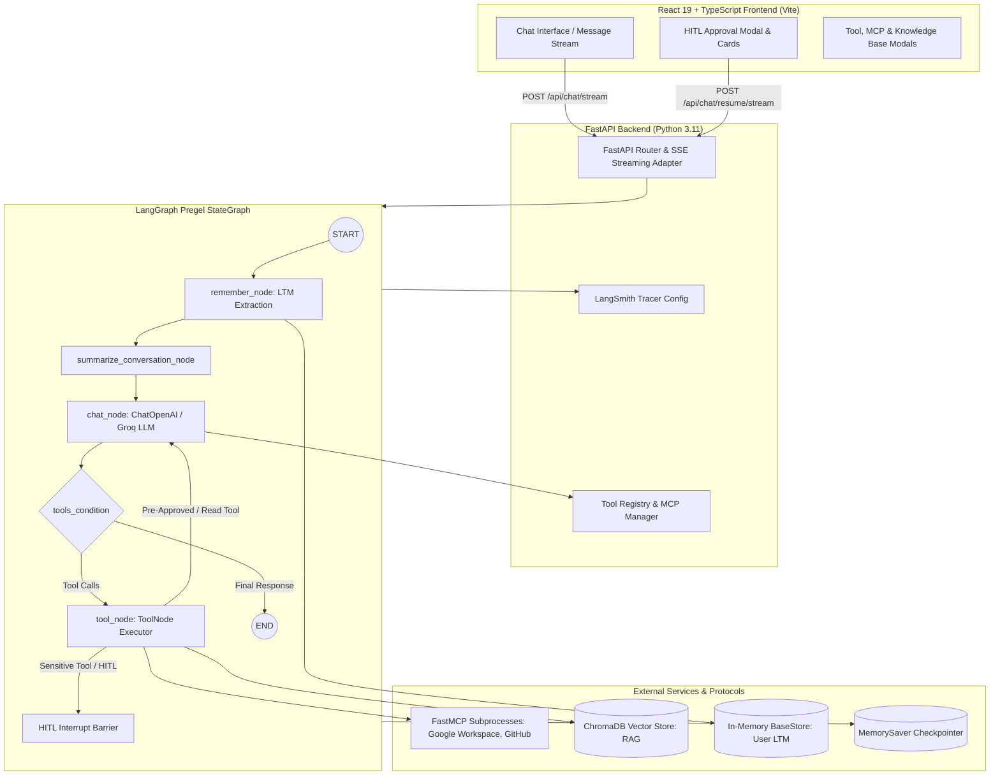

# System Architecture

## 1. High-Level Architecture

The Agentic AI RAG Chatbot is an asynchronous, event-driven agentic platform built on **LangGraph** (agent state management and execution), **FastAPI** (streaming backend API), and **React 19 + TypeScript** (responsive chat interface with tool and HITL cards).



---

## 2. LangGraph Workflow Topology

The core agent loop is structured as a directed acyclic graph with conditional tool-calling cycles:

1. **`START` $\to$ `remember` (`remember_node`)**:
   - Analyzes incoming user text against existing user memories.
   - Extracts atomic factual items (profile, preferences, projects) using heuristic fallback or structured LLM calls.
   - Stores new facts in `InMemoryStore` under namespace `("user", user_id, "memories")`.

2. **`remember` $\to$ `summarize` (`summarize_conversation_node`)**:
   - Inspects conversation history length.
   - If history exceeds 6 messages, triggers a rolling summary of older turns and retains the 4 most recent messages.

3. **`summarize` $\to$ `chat` (`chat_node`)**:
   - Injects user memories and conversation summary into the system prompt.
   - Binds active tools (filtered against `disabled_tools`).
   - Invokes the LLM (`openai/gpt-oss-120b` via Groq OpenAI compatibility or `gpt-4o-mini`).

4. **`chat` $\to$ `tools_condition` (Conditional Router)**:
   - If the model returns `tool_calls`, routes to `tools`.
   - If the model returns plain content, routes to `END`.

5. **`tools` (`tool_node`)**:
   - Executes built-in, RAG, or MCP tools.
   - If a sensitive tool (`send_email_action`, `execute_database_mutation`) is called, triggers `langgraph.types.interrupt(payload)` to pause graph execution and yield an interactive approval event to the frontend.
   - On completion or resumption, returns `ToolMessage` and routes back to `chat`.

---

## 3. Storage and Persistence Layers

| Layer | Implementation | Purpose | Lifespan |
|---|---|---|---|
| **Short-Term Memory** | `MemorySaver` checkpointer | Graph checkpoints per `thread_id`, task interrupts, tool execution states | Current session / Thread |
| **Long-Term Memory** | `InMemoryStore` (`BaseStore`) | Atomic user facts and preferences (`("user", user_id, "memories")`) | Cross-thread / User lifetime |
| **RAG Vector Database** | `ChromaDB` (`langchain-chroma`) | Chunk embeddings and cosine similarity retrieval for uploaded PDFs/documents | Persistent disk |
| **MCP Workspace Store** | `backend/data/google_workspace/*.json` | Google Drive mock files, Gmail queue, and Calendar events fallback | Persistent disk |
| **Google OAuth Store** | `backend/data/google_workspace/token.json` | Google Cloud OAuth2 refresh tokens for live Workspace API | Persistent disk |

---

## 4. Streaming Architecture (SSE)

Communication between FastAPI and React uses **Server-Sent Events (SSE)** via `stream_graph_events()` in `app/streaming/adapter.py`:

```
Client (React)                             Server (FastAPI / LangGraph)
      |                                                  |
      | -------- POST /api/chat/stream ----------------> |
      | <------- event: stream_start ------------------- |
      | <------- event: tool_call_start ---------------- |
      | <------- event: hitl_interrupt ----------------- | (Execution paused)
      |                                                  |
 [User clicks Approve]                                   |
      | -------- POST /api/chat/resume/stream ---------> |
      | <------- event: tool_call_end ------------------ |
      | <------- event: token (streaming text) --------- |
      | <------- event: stream_end --------------------- |
```
