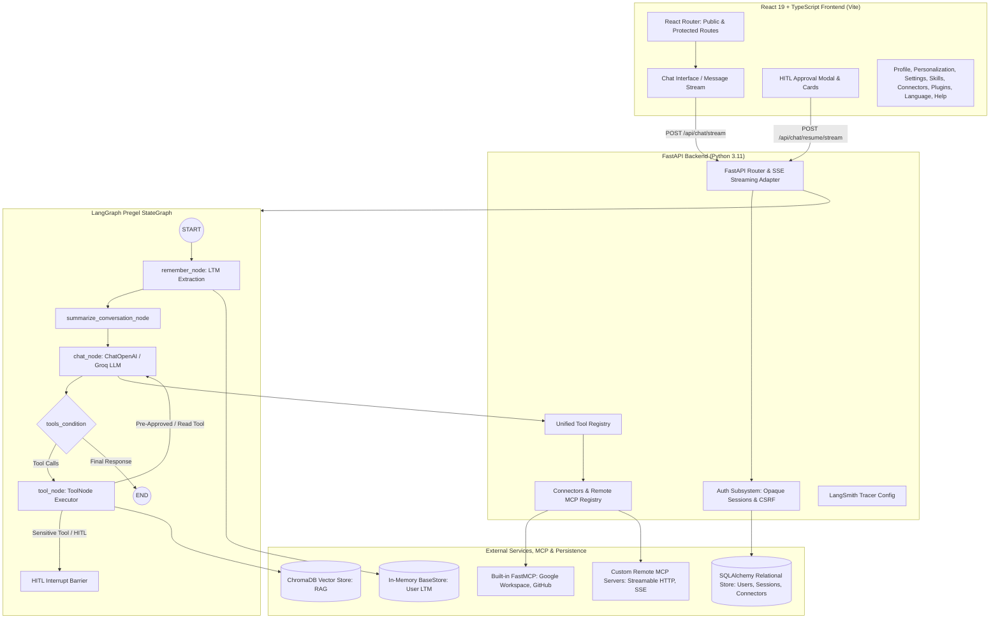

# System Architecture

## 1. High-Level Architecture

Nexus AI is an asynchronous, multi-agent AI workspace built on **LangGraph** (agent state graphs, checkpointers, and cyclical tool loops), **FastAPI** (streaming API, authentication, and MCP registry), and **React 19 + TypeScript** (responsive modular workspace shell).



---

## 2. Information Architecture & Navigation Separation

Nexus AI strictly separates user concerns into dedicated product areas:

- **My Profile (`/profile`)**: Strictly user identity (Avatar, Full Name, Display Name, Email, Account Join Date).
- **Personalization (`/personalization`)**: Assistant interaction behavior (Response Style, Conversation Tone, Preferred Language, Custom Instructions, Citation Pills toggle, Tool Badges toggle).
- **Settings (`/settings`)**: Application configuration (General shortcuts, Appearance theme, Privacy & Data export, Active security sessions, Long-Term Memory manager).
- **Language (`/settings/language`)**: Dedicated interface and conversational language selection.
- **Skills (`/skills`)**: High-level agent workflows (Code Debugging, RAG Research, GitHub Assistant, Google Workspace, SQL Inspection) mapping required tools and MCP capabilities.
- **Connectors (`/connectors`)**: External service connections (GitHub, Google Workspace, Slack, Notion) and custom remote MCP server registrations.
- **Plugins (`/plugins`)**: Modular extension packages (ChromaDB RAG, Python Code Sandbox, Long-Term Memory Engine, FastMCP Universal Bridge).
- **Help & Capabilities (`/help`)**: System reference explaining agent loops, tools, connectors, and safety rules.

---

## 3. Storage and Persistence Layers

| Layer | Implementation | Purpose | Lifespan |
|---|---|---|---|
| **User & Session Store** | SQLAlchemy + Alembic (`sqlite+aiosqlite` / `asyncpg`) | `users`, `sessions`, `user_preferences`, `connectors` | Persistent DB |
| **Short-Term Memory** | `MemorySaver` checkpointer | Graph checkpoints per `thread_id`, task interrupts, tool execution states | Current session / Thread |
| **Long-Term Memory** | `InMemoryStore` (`BaseStore`) | Atomic user facts and preferences (`("user", user_id, "memories")`) | Cross-thread / User lifetime |
| **RAG Vector Database** | `ChromaDB` (`langchain-chroma`) | Chunk embeddings and cosine similarity retrieval for uploaded PDFs/documents | Persistent disk |
| **MCP Workspace Store** | `backend/data/google_workspace/*.json` | Google Drive mock files, Gmail queue, and Calendar events fallback | Persistent disk |
| **Google OAuth Store** | `backend/data/google_workspace/token.json` | Google Cloud OAuth2 refresh tokens for live Workspace API | Persistent disk |

---

## 4. Streaming Architecture (SSE)

Communication between FastAPI and React uses **Server-Sent Events (SSE)** via `stream_graph_events()` in `app/streaming/adapter.py`:

```
Client (React)                             Server (FastAPI / LangGraph)
      |                                                  |
      | -------- POST /api/chat/stream ----------------> |
      | <------- event: stream_start ------------------- |
      | <------- event: tool_call_start ---------------- |
      | <------- event: hitl_interrupt ----------------- | (Execution paused)
      |                                                  |
 [User clicks Approve]                                   |
      | -------- POST /api/chat/resume/stream ---------> |
      | <------- event: tool_call_end ------------------ |
      | <------- event: token (streaming text) --------- |
      | <------- event: stream_end --------------------- |
```
