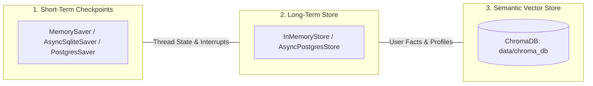

# Database & Data Persistence

## 1. Storage Layers Architecture

The system uses three specialized storage layers designed for specific data lifecycles:



---

## 2. Checkpointer (State Persistence)

- **Default Development**: `langgraph.checkpoint.memory.MemorySaver` (in-memory per backend process lifecycle).
- **Production Migration (PostgreSQL / SQLite)**:
  Compatible with `langgraph.checkpoint.postgres.AsyncPostgresSaver` and `langgraph.checkpoint.sqlite.aio.AsyncSqliteSaver`.
- **Saved Data**:
  - Full message histories per `thread_id`.
  - Pending HITL interrupts and tool call states.
  - Active graph execution pointers and step counters.

---

## 3. Long-Term Memory Namespaces

The `BaseStore` organizes user facts into hierarchical namespaces:

```text
("user", "<user_id>", "memories")
   ├── item_id_1: { "category": "profile", "content": "Senior AI engineer", ... }
   ├── item_id_2: { "category": "preference", "content": "Concise code answers", ... }
   └── item_id_3: { "category": "project", "content": "LangGraph RAG Agent", ... }
```

---

## 4. ChromaDB Vector Store

- **Location**: `backend/data/chroma_db/`
- **Collection**: `agentic_knowledge_base`
- **Embedding Model**: `text-embedding-3-small` (1536 dim) or HuggingFace fallback.
- **Distance Metric**: Cosine similarity (`hnsw:space`: `cosine`).
- **Metadata Fields**: `filename`, `page`, `chunk_index`, `uploaded_at`, `file_size_bytes`.
