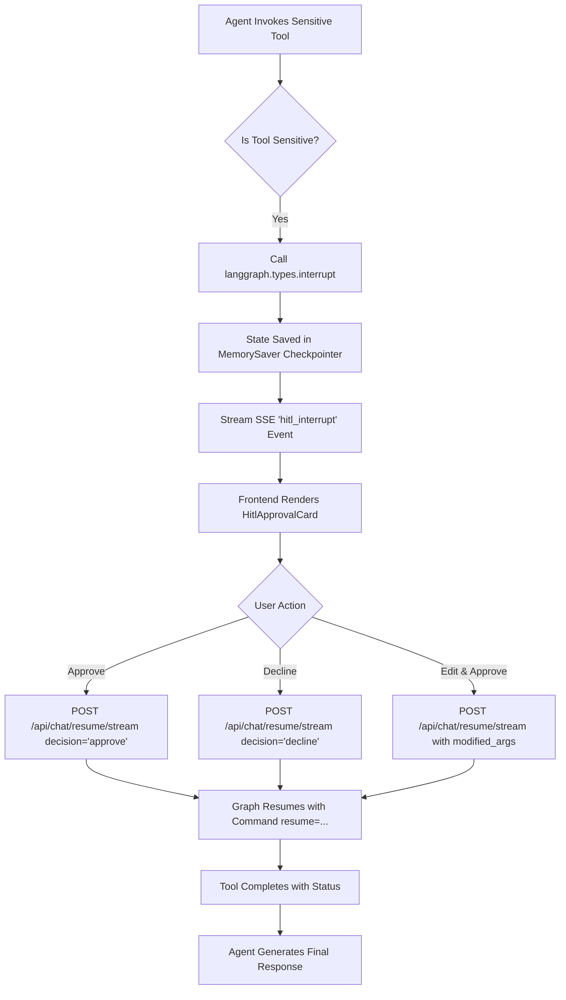

# Human-in-the-Loop (HITL) Guidelines & Specification

## 1. Core Principles

1. **Pre-Execution Authorization (Principle 1)**:
   Human approval MUST happen **BEFORE** any sensitive or irreversible action takes place. The agent pauses before dispatching emails, mutating databases, or modifying sensitive external files.

2. **Server-Enforced Safety (Principle 2)**:
   HITL is **never** a client-side JavaScript prompt. The LangGraph backend execution loop explicitly interrupts execution via `langgraph.types.interrupt()`. The state is safely stored in the checkpoint and cannot advance without an authorized `Command(resume=...)`.

3. **Risk-Tiered Action Classification (Principle 3)**:
   Read operations (search, list, retrieve) are autonomous by default. Write and destructive operations (send email, mutate database, drop tables) require mandatory approval.

---

## 2. Risk Classification Matrix

| Tool | Action | Risk Level | HITL Required? | Description |
|---|---|---|---|---|
| `send_email_action` | Send email | **High** | **Yes (Mandatory)** | Sends email to an external recipient. |
| `execute_database_mutation` | INSERT / UPDATE / DELETE / DROP | **Critical** | **Yes (Mandatory)** | Modifies or deletes database records. |
| `gmail_send_email` | Send live Gmail | **High** | **Yes (Configurable)** | Dispatches real email via Gmail API. |
| `gcalendar_create_event` | Schedule meeting | **Medium** | Optional | Creates event on Google Calendar. |
| `command_runner` | Run shell command | **High** | Protected | Executes sandboxed shell commands. |
| `gdrive_search_files` / `gdrive_read_file` | Read Drive file | **Low** | No | Read-only search & inspection. |
| `gmail_search_emails` / `gmail_read_thread` | Read Gmail | **Low** | No | Read-only email lookup. |
| `gcalendar_list_events` | List calendar | **Low** | No | Read-only event lookup. |
| `github_get_my_repos` / `github_get_repo` | Inspect repo | **Low** | No | Read-only GitHub queries. |
| `search_knowledge_base` | RAG retrieval | **Low** | No | Read-only vector search. |
| `web_search` / `fetch_web_page` | Web lookup | **Low** | No | Read-only web retrieval. |

---

## 3. Interrupt & Resume Lifecycle



---

## 4. Event & State Schemas

### `HitlInterruptEvent` (SSE Output)
```json
{
  "event": "hitl_interrupt",
  "data": {
    "interrupt_id": "5b4ec2b8-f07f-4318-8f83-e1d5ba5d39d9",
    "tool_name": "send_email_action",
    "action": "Send Email to sarah@company.ai",
    "description": "Subject: 'Project Demo'\n\nBody Preview:\nEverything is ready....",
    "args": {
      "recipient": "sarah@company.ai",
      "subject": "Project Demo",
      "body": "Everything is ready."
    },
    "thread_id": "792673e1-6236-4323-88ea-06cc84e3a934"
  }
}
```

### `HitlResumeRequest` (POST `/api/chat/resume/stream`)
```json
{
  "thread_id": "792673e1-6236-4323-88ea-06cc84e3a934",
  "interrupt_id": "5b4ec2b8-f07f-4318-8f83-e1d5ba5d39d9",
  "decision": "approve",
  "modified_args": {
    "subject": "Updated Subject: Project Demo"
  }
}
```

---

## 5. Security & Safety Rules

1. **State Isolation**: Interrupt state is strictly bound to `(thread_id, user_id)` in the checkpointer.
2. **Replay Protection**: An `interrupt_id` can be resumed only once. Subsequent resume calls on an already completed step return an error or are ignored.
3. **Graceful Fallback on Browser Disconnect**: If the user closes the browser during an interrupt, the conversation thread remains safely in the `paused` state in the database/checkpointer and can be resumed upon reopening the thread.
