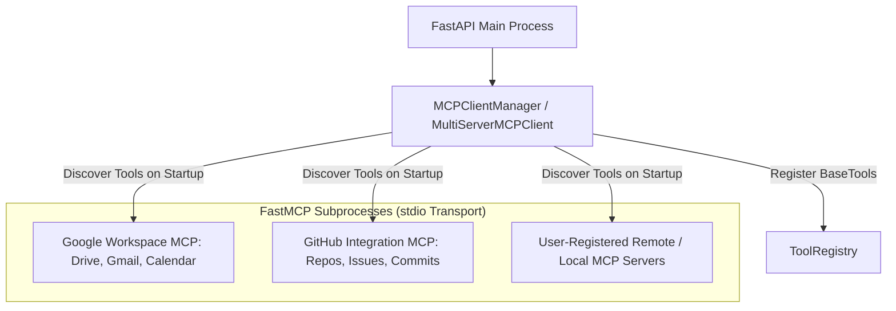

# Model Context Protocol (MCP) Architecture

## 1. Overview

The chatbot integrates external tools, resources, and cloud integrations via the **Model Context Protocol (MCP)** using `langchain-mcp-adapters` and FastMCP servers.

---

## 2. Configured MCP Servers

| Server ID | Server Name | Transport | Discovered Tools | Authentication |
|---|---|---|---|---|
| `google_workspace` | Google Workspace MCP | `stdio` (`sys.executable`) | 8 tools (`gdrive_*`, `gmail_*`, `gcalendar_*`) | OAuth2 (`token.json` / `credentials.json`) + Sandbox fallback |
| `github_mcp` | GitHub Integration MCP | `stdio` (`sys.executable`) | 7 tools (`github_*`) | GitHub Token (`GITHUB_PERSONAL_ACCESS_TOKEN`) |
| Custom Servers | User Added MCP | `stdio` / `sse` / `streamable_http` | Dynamic | Configurable via `/api/mcp/servers` |

---

## 3. Discovered MCP Tools List

### Google Workspace MCP (`backend/app/mcp/servers/google_workspace.py`):
- `gdrive_search_files(query, max_results)`: Search files in Google Drive.
- `gdrive_read_file(file_name_or_id)`: Read text content of Drive documents.
- `gdrive_list_files(max_results)`: List all files in Google Drive.
- `gmail_search_emails(query, max_results)`: Search Gmail messages.
- `gmail_read_thread(thread_id_or_subject)`: Read full email message body.
- `gmail_send_email(to, subject, body)`: Send an email via Gmail.
- `gcalendar_list_events(date, query, max_results)`: List upcoming events from Google Calendar.
- `gcalendar_create_event(summary, start_time, end_time, description, attendees)`: Schedule meetings.

### GitHub Integration MCP (`backend/app/mcp/servers/github_server.py`):
- `github_get_my_user_profile()`: View authenticated GitHub user profile.
- `github_get_my_repos(limit)`: List user's repositories.
- `github_get_latest_push(repo)`: Get latest commit/push.
- `github_get_repo(repo)`: Get repository stats, stars, issues.
- `github_search_issues(repo, query, state)`: Search issues and PRs.
- `github_list_commits(repo, limit)`: List recent commit history.
- `github_get_file_content(repo, path, branch)`: Read code files from GitHub.

---

## 4. MCP Authentication & Lifecycle

1. **Subprocess Environment Propagation**:
   FastMCP servers run over standard I/O (`stdio`). Both `google_workspace.py` and `github_server.py` load `backend/.env` to ensure API keys and OAuth tokens are available inside subprocesses.
2. **Error Isolation**:
   `MCPClientManager` connects to each server independently. A failure in one MCP server does not block or crash other servers or the main application.
3. **Dynamic Management API**:
   - `GET /api/mcp/servers`: List registered MCP servers and statuses.
   - `POST /api/mcp/servers`: Add a new MCP server.
   - `DELETE /api/mcp/servers/{server_id}`: Remove an MCP server.
   - `POST /api/mcp/reload`: Refresh and rediscover all MCP tools.
