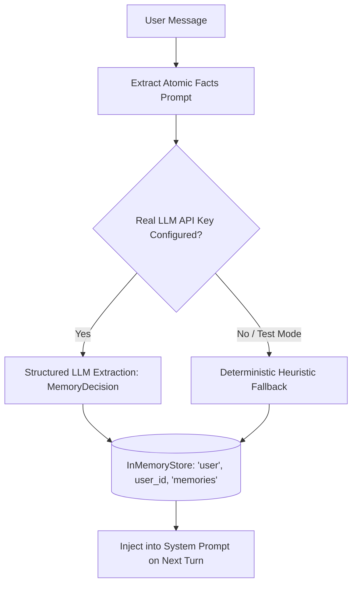

# Memory Architecture & Lifecycle

## 1. Memory Tiers Overview

The system maintains a clean separation between **Short-Term Memory (STM)** (thread-specific context) and **Long-Term Memory (LTM)** (cross-thread durable user knowledge):

| Property | Short-Term Memory (STM) | Long-Term Memory (LTM) |
|---|---|---|
| **Scope** | Single conversation thread (`thread_id`) | Global to the user across all threads (`user_id`) |
| **Storage** | LangGraph `MemorySaver` checkpointer | `InMemoryStore` (`BaseStore`) |
| **Namespace** | `(thread_id, checkpoint_id)` | `("user", user_id, "memories")` |
| **Contents** | Chronological message sequence (`HumanMessage`, `AIMessage`, `ToolMessage`) | Atomic factual knowledge (profile, preferences, tech stacks, constraints) |
| **Management** | Rolling summarization (reduces tokens over long chats) | Real-time extraction, deduplication, conflict reconciliation, manual deletion |

---

## 2. Long-Term Memory (LTM) Extraction Pipeline

During every turn, the `remember_node` analyzes the user's latest input:



### Memory Item Categories:
- **`profile`**: Identity, role, name, background (e.g. *"Works as a senior AI engineer"*).
- **`preference`**: Communication style, constraints (e.g. *"Prefers concise code without explanation"*).
- **`project`**: Active repositories, stacks, tools (e.g. *"Building an agentic RAG chatbot with LangGraph"*).
- **`fact`**: General durable facts explicitly provided by the user.

---

## 3. Rolling Conversation Summarization

To prevent context exhaustion and keep requests within Groq/LLM token limits:

1. When a thread contains **more than 6 messages**:
   - The `summarize_conversation_node` extracts older messages.
   - Summarizes the key conversational context and earlier decisions.
   - Retains the **4 most recent messages** verbatim.
   - Stores the generated summary in `state["summary"]`.
2. On subsequent turns, the system prompt includes:
   ```text
   PREVIOUS CONVERSATION SUMMARY:
   <condensed summary of earlier discussion>
   ```

---

## 4. Memory Conflict Resolution & Cleanup

When user facts evolve over time (e.g. *"Lives in New York"* followed by *"Moved to London"*):

1. **Reconciliation Agent** (`backend/app/memory/cleaner.py`):
   - Scans all memories in `("user", user_id, "memories")`.
   - Identifies contradictions, supersessions, and duplicates.
   - Resolves to the latest valid state.
2. **Manual Memory Management API**:
   - `GET /api/memory?user_id=...`: View active memories.
   - `PUT /api/memory/{memory_id}`: Edit a memory fact.
   - `DELETE /api/memory/{memory_id}`: Delete a specific memory item.
   - `DELETE /api/memory/clear/all`: Clear all memories for a user.
   - `POST /api/memory/cleanup/reconcile`: Trigger automated LLM conflict resolution.
