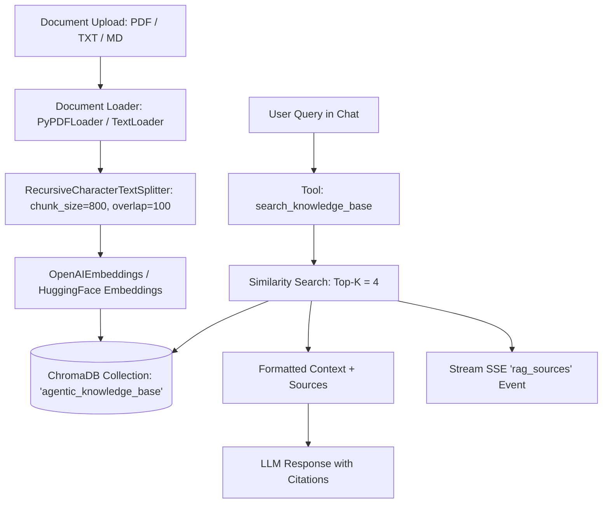

# Retrieval-Augmented Generation (RAG) Architecture

## 1. Pipeline Overview

The RAG subsystem enables semantic search and knowledge retrieval over user-uploaded PDF, TXT, and Markdown documents.



---

## 2. Chunking & Ingestion Parameters

| Parameter | Value | Purpose |
|---|---|---|
| **Supported Types** | `.pdf`, `.txt`, `.md` | Handles documentation, papers, resumes, transcripts |
| **Chunk Size** | `800` characters | Preserves coherent semantic paragraphs |
| **Chunk Overlap** | `100` characters | Prevents losing sentence context across chunk boundaries |
| **Vector Store** | `ChromaDB` (`langchain-chroma`) | Persistent embedded vector database |
| **Top-K Retrieval** | `4` documents | Balanced context window without token bloat |
| **Embedding Model** | `text-embedding-3-small` (or local fallback) | 1536-dimensional embeddings |

---

## 3. Source Citation Protocol

When `search_knowledge_base` executes during chat streaming, retrieved chunks are emitted as a structured SSE event before the final response:

```json
{
  "event": "rag_sources",
  "data": {
    "sources": [
      {
        "filename": "Agentic_AI_Architecture.pdf",
        "page": 3,
        "snippet": "LangGraph Pregel engine orchestrates cyclically routed agent states..."
      }
    ]
  }
}
```

The React frontend displays these as clickable citation pills below the assistant's message.
